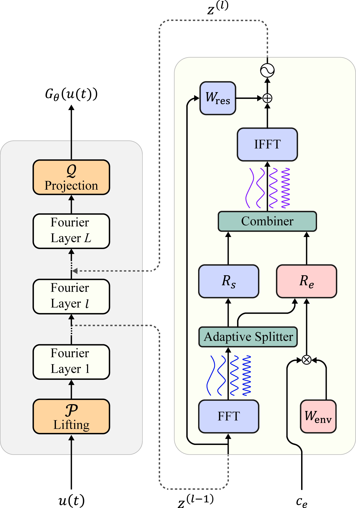

<h2 align="center">
<p> Generalize to New Dynamical Systems via Frequency Domain Adaptation</p>
</h2>

---

<p align="center">
    
    <!-- <br>Fig 1. The overview of network architecture for LSSAE.</br> -->
</p>

This repository provides the official implementations and experiments for our research in generalizable neural surrogate for numerical solvers, introduced in [FNSDA](https://ieeexplore.ieee.org/document/11045837). The core code for implement our method can be found in [models/fourier_solver.py](models/fourier_solver.py). Please follow the steps to prepare running environment, and run our code.


### Requirements

- python 3.9
- Pytorch 2.0 or above
- torchdiffeq
- Pyyaml

All the required packages can be installed via conda. 


### 🚀 Quick Start

#### 1. Running
```
# 1. Model training for the Lotka-Volterra dataset
python main.py --config_file ./configs/Fourier.yaml 

# 2. Model evaluation
  # please change the yaml file as follows
  mode: 'test'
  task: 'inter'  # for inter-trajectory adaptation task
  or
  task: 'extra'  # for extra-trajectory adaptation task
```


#### 2. Other Datasets

To apply our method to other datasets, you need to specify the dataset info and modify several hyperparameters:
```
# Glycolitic-Oscillator dataset
  data_name: 'g_osci'
  output_dir: './logs/baseline/g_osci/FNSDA'

# Gray-Scott dataset
  data_name: 'gray'
  output_dir: './logs/baseline/gray/FNSDA'
  code_dim: 20

# Navier-Stokes dataset
  data_name: 'navier'
  output_dir: './logs/baseline/navier/FNSDA'
  code_dim: 20
  train_epochs: 100000
```


### Citations
If you find this repo useful for your research, please cite the following papers:

    @article{Qin2025FNSDA,
    title={Generalizing to New Dynamical Systems via Frequency Domain Adaptation},
    author={Tiexin Qin and Hong Yan and Haoliang Li},
    journal={IEEE Transactions on Pattern Analysis and Machine Intelligence},
    year={2025},
    }
